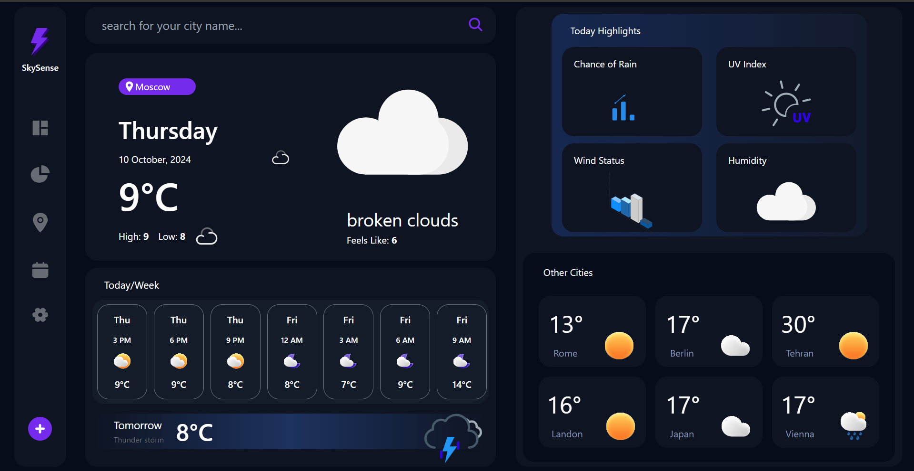

# Weather Dashboard

Welcome to the Weather Dashboard, a responsive React application designed to provide real-time weather information and forecasts for various cities around the world.

## Features
- **Real-Time Weather Data**: Utilizing the OpenWeatherMap API, this application fetches current weather data and forecasts for up to six major capitals.
- **Responsive Design**: Built with Tailwind CSS and DaisyUI, the dashboard offers a seamless experience across different devices and screen sizes.
- **Custom Hooks**: The application employs custom React hooks to efficiently manage and manipulate API data.
- **State Management**: Integrated with React Query and Context API for robust state management and data fetching.
- **Animated Icons**: Uses animated icons from Lottie to enhance the visual appeal and user experience.

## Technologies Used
### Frontend:
- React.js
- Tailwind CSS for styling
- DaisyUI for pre-designed components

### State Management:
- React Query for data fetching
- Context API for managing global state

### API:
- OpenWeatherMap API for weather data

## Getting Started
To get started with the project, follow these steps:

1. **Clone the repository**:
   ```bash
   git clone [repository-url]
   ```

2. **Navigate to the project directory**:
   ```bash
   cd weather-dashboard
   ```

3. **Install the dependencies**:
   ```bash
   npm install
   ```

4. **Run the development server**:
   ```bash
   npm run dev
   ```

## Adding Images
To include an image of your project in the README, place the image in the `src/assets` directory (or a relevant directory of your choice), and then use the following markdown syntax to display the image:

```markdown

```

Replace `src/assets/project-screenshot.png` with the actual path to your image file.

## Conclusion
This Weather Dashboard not only provides essential weather information but also serves as an excellent example of using modern React features and best practices. The responsive design ensures that users can access weather updates anytime, anywhere.

